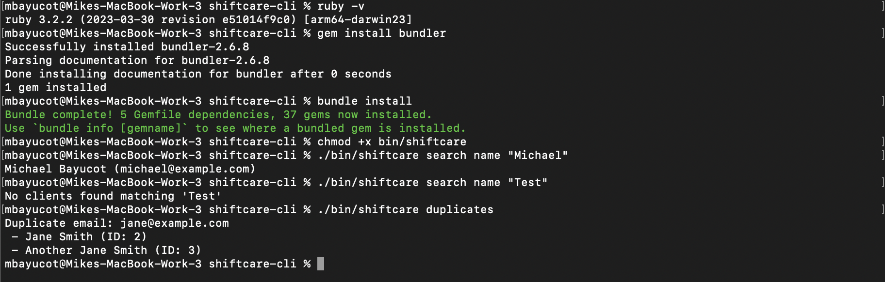

# ShiftCare CLI

A Ruby command-line tool that allows you to search client data and identify duplicate email entries.



---

## Features

- Search clients by partial name match
- Detect duplicate client emails
- Built on `dry-transaction` for clean, composable service operations — enabling better error handling and separation of business logic
- RSpec test suite for reliability
- RuboCop for code quality enforcement

---

## Setup

Ensure Ruby is installed:

```bash
ruby -v
```

Install Bundler:

```bash
gem install bundler
```

Install dependencies:

```bash
bundle install
```

Make the CLI executable:

```bash
chmod +x bin/shiftcare
```

Run the CLI:

```bash
ruby bin/shiftcare search name "Michael"
```

Or simply:

```bash
./bin/shiftcare search name "Michael"
```

---

## Usage

To search clients by name:

```bash
./bin/shiftcare search name "Michael"
```

To check for duplicate emails:

```bash
./bin/shiftcare duplicates
```

To run tests:

```bash
rspec
```

---

## Assumptions and Decisions Made

- Client data is expected to come from a static `clients.json` file located at the project root.
- Searches are currently limited to name matching only.
- Duplicate detection is based strictly on the `email` field.
- `dry-transaction` is used to decouple service logic from the CLI interface, enabling cleaner error handling and easier testing.

---

## Known Limitations

- Currently supports searching by name only — not by email or ID.
- Email format validation is not implemented.
- Designed for small to medium-sized datasets that can be loaded entirely into memory.

---

## Areas for Future Improvement

- **Support dynamic field-based searching**  
  Enable searching by any JSON field, such as `email`, `id`, or custom attributes, for greater flexibility.

- **Add pagination**  
  Prevent long terminal outputs by paginating results when datasets are large.

- **Integrate Bluprinter for CLI output formatting**  
  Improve readability and create reusable, customizable serializers.

- **Validate and normalize data**  
  Trim whitespace, convert fields to lowercase, and verify email formats before processing.

- **Enhance CLI with flags**  
  Add support for CLI options like `--field name --query Michael` to make usage more intuitive.
